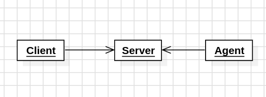

```
  mmmm             #  mmmmm           m      |    ⠀⢀⣴⣾⣿⣿⣿⣷⣦⡄⠀⣴⣾⣿⣿⣿⣿⣶⣄⠀⠀
 #"   "  mmm    mmm#  #   "#  mmm   mm#mm    |    ⣰⣿⣿⣿⣿⣿⣿⣿⠋⢠⣾⣿⣿⣿⣿⣿⣿⣿⣿⣧⠀
 "#mmm  "   #  #" "#  #mmmm" "   #    #      |    ⣿⣿⣿⣿⣿⣿⣿⣿⣿⣶⣌⠛⣿⣿⣿⣿⣿⣿⣿⣿⡆ 
     "# m"""#  #   #  #   "m m"""#    #      |    ⣿⣿⣿⣿⣿⣿⣿⣿⣿⡿⢁⣼⣿⣿⣿⣿⣿⣿⣿⣿⠁
 "mmm#" "mm"#  "#m##  #    " "mm"#    "mm    |    ⠸⣿⣿⣿⣿⣿⣿⣿⡟⢀⣾⣿⣿⣿⣿⣿⣿⣿⣿⠏⠀
                                             |    ⠀⠙⣿⣿⣿⣿⣿⣿⣄⠻⣿⣿⣿⣿⣿⣿⣿⣿⠏⠀⠀
                                             |    ⠀⠀⠈⠻⣿⣿⣿⣿⣿⣧⡈⢿⣿⣿⣿⣿⡟⠁⠀⠀⠀
                                             |    ⠀⠀⠀⠀⠈⠻⣿⣿⣿⣿⡇⢸⣿⣿⠟⠉⠀⠀⠀⠀⠀
                                             |    ⠀⠀⠀⠀⠀⠀⠈⠙⢿⡿⠀⡿⠛⠁⠀⠀⠀     
```

# SadRat

Um Remote Access Toolkit (RAT) somente de estudo feito em Go.

## Conceitos e Arquitetura

O desenvolvimento desse projeto utiliza Domain Driven Design (DDD), Test Driven Development (TDD), Clean Architecture, e influencias da Arquitetura Hexagonal.



O server é o intermediario da comunicação entre o client (atacante) e a o agent (atacado).

De forma mais concreta, o client envia um job contendo o comando, os argumentos, e o id do agente, para o servidor, e ele armazena esse job. Depois disso, o agent requisita ao servidor, quais jobs o servidor tem com o id dele, após isso ele recebe, executa, e manda o resultado para o servidor e este armazena eles; ao fim do ciclo o client requisitas os resultados ao servidor.

O modelo de dominío está na pasta "docs/", ademais esse software foi pensado focado nas abstrações, para através do desacoplamento, conseguir realizar a meta da programção orientada a objetos e da arquitetura hexagonal de substituir facilmente um objeto por outro, outra citação relevante sobre programar para interfaces aparece nas partes iniciais do Design Patterns do Go4, e isso é feito nesse projeto.

De forma mais prática, temos o conjunto ClientHTTP, ServerHTTP, e AgentHTTP, que estão na RatFactoryHTTP, evidentemente todas elas são Client, Server, Agent e RatFactory respectivamente. A vantagem dessa abordagem é, num cenário hipotético onde a comunicação HTTP for bloqueada, ser possível a fácil implementação de um RatFactoryHTTPS, ou RatFactoryDNS, podendo adaptar o software de modo muito mais fácil, pelas abstrações, aos cenários particulares.

## Requisitos

- Go: 1.26.5
- Ubuntu 24.04

## Como Executar o Projeto

## Testes Unitários

```
go test ./tests/
```

## Testes de Integração

```
go test -v ./tests/integration/
```

## Interface Client

> (!) a interface gráfica ainda não está pronta porque o projeto ainda está em desenvolvimento

```
go run cmd/client/main.go <http://ip-do-server:porta>
```

```
╭──────────────────────────────────────────────────╮╭──────────────────────────────────────────────────╮
│                                                  ││ ⠀⢀⣴⣾⣿⣿⣿⣷⣦⡄⠀⣴⣾⣿⣿⣿⣿⣶⣄⠀⠀                       │
│  mmmm             #  mmmmm           m           ││ ⣰⣿⣿⣿⣿⣿⣿⣿⠋⢠⣾⣿⣿⣿⣿⣿⣿⣿⣿⣧⠀                       │
│ #"   "  mmm    mmm#  #   "#  mmm   mm#mm         ││ ⣿⣿⣿⣿⣿⣿⣿⣿⣿⣶⣌⠛⣿⣿⣿⣿⣿⣿⣿⣿⡆                       │
│ "#mmm  "   #  #" "#  #mmmm" "   #    #           ││ ⣿⣿⣿⣿⣿⣿⣿⣿⣿⡿⢁⣼⣿⣿⣿⣿⣿⣿⣿⣿⠁                       │
│     "# m"""#  #   #  #   "m m"""#    #           ││ ⠸⣿⣿⣿⣿⣿⣿⣿⡟⢀⣾⣿⣿⣿⣿⣿⣿⣿⣿⠏⠀                       │
│ "mmm#" "mm"#  "#m##  #    " "mm"#    "mm         ││ ⠀⠙⣿⣿⣿⣿⣿⣿⣄⠻⣿⣿⣿⣿⣿⣿⣿⣿⠏⠀⠀                       │
│                                                  ││ ⠀⠀⠈⠻⣿⣿⣿⣿⣿⣧⡈⢿⣿⣿⣿⣿⡟⠁⠀⠀⠀                       │
│> _                                               ││ ⠀⠀⠀⠀⠈⠻⣿⣿⣿⣿⡇⢸⣿⣿⠟⠉⠀⠀⠀⠀⠀                       │
│                                                  ││ ⠀⠀⠀⠀⠀⠀⠈⠙⢿⡿⠀⡿⠛⠁⠀⠀⠀⠀⠀⠀⠀                       │
│                                                  ││                                                  │
│                                                  ││                                                  │
│                                                  ││[+] SadRat C&C Interface iniciada...              │
│                                                  ││                                                  │
│                                                  ││                                                  │
│                                                  ││                                                  │
│                                                  ││                                                  │
│                                                  ││                                                  │
│                                                  ││                                                  │
│                                                  ││                                                  │
│                                                  ││                                                  │
╰──────────────────────────────────────────────────╯╰──────────────────────────────────────────────────╯

```

# Referencias

- Black Hat Rust - Sylvain Kerkour
- Black Hat Go - Tom Steele
- Design Patterns: Elements Of Reusable Object-oriented Software - GoF
- Agile Principles, Patterns, and Practices in C# - Uncle Bob
- Domain-Driven Design: Tackling Complexity in the Heart of Software - Eric Evnas
- Patterns of Enterprise Application Architecture - Martin Fowler